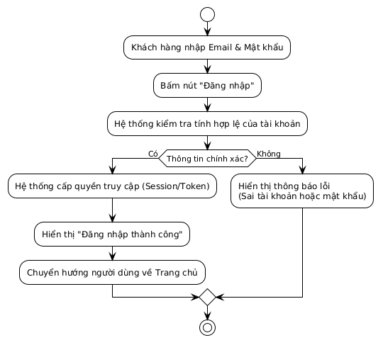
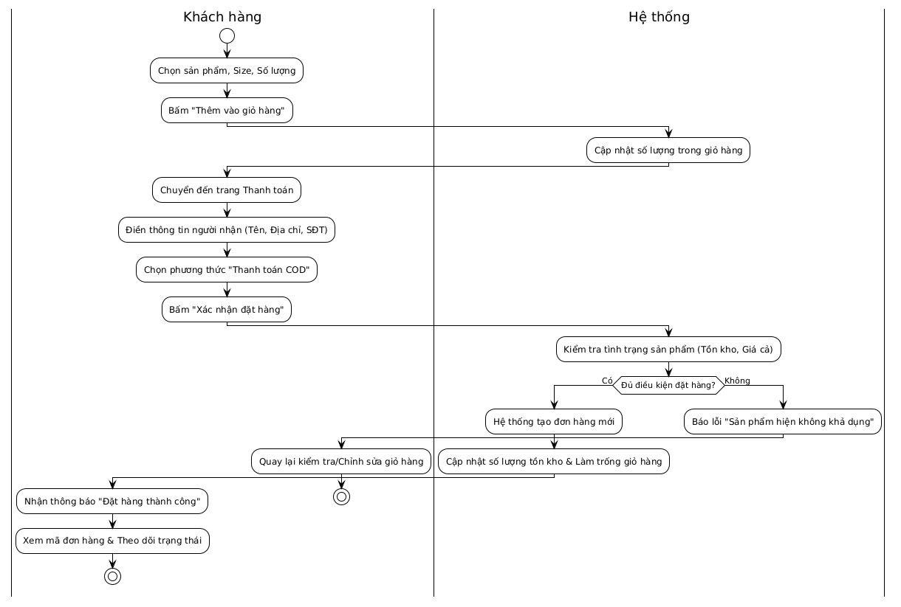
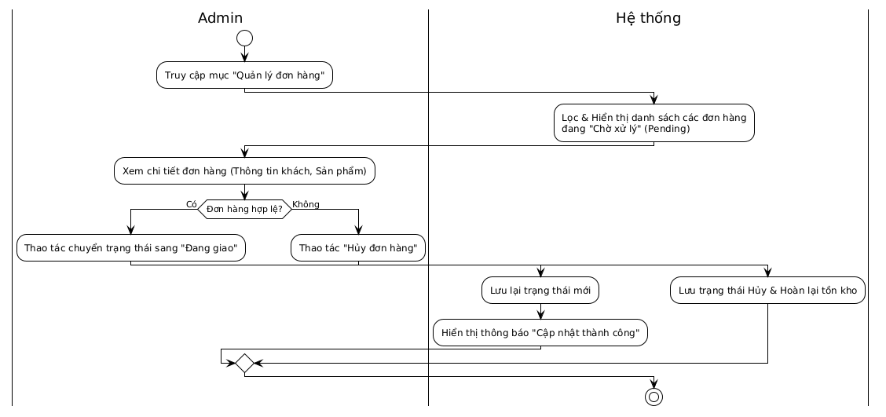

# ĐẶC TẢ CHI TIẾT SƠ ĐỒ HOẠT ĐỘNG (ACTIVITY DIAGRAMS)

Phần này mô tả các bước xử lý logic và luồng ra quyết định của các chức năng trọng yếu trong hệ thống, tập trung vào trải nghiệm người dùng và quy trình nghiệp vụ tổng quát.

---

## 1. Sơ đồ: Luồng Đăng nhập (Login Activity)
**Mục đích:** Đặc tả quá trình kiểm tra thông tin định danh và cấp quyền truy cập cho khách hàng.

* **Bước 1 (Khởi tạo):** Khách hàng điền thông tin `Email` và `Mật khẩu` vào biểu mẫu và nhấn nút "Đăng nhập".
* **Bước 2 (Kiểm tra):** Hệ thống tiếp nhận dữ liệu và tiến hành kiểm tra tính hợp lệ của tài khoản (tồn tại Email và khớp Mật khẩu).
* **Bước 3 (Rẽ nhánh kết quả):**
  * **Trường hợp [Hợp lệ]:** Hệ thống cấp quyền truy cập (Session/Token) cho phiên làm việc. Sau đó, hiển thị thông báo "Đăng nhập thành công" và tự động điều hướng khách hàng về Trang chủ. Quy trình kết thúc.
  * **Trường hợp [Không hợp lệ]:** Hệ thống từ chối truy cập, trả về thông báo lỗi (ví dụ: Sai tài khoản hoặc mật khẩu) ngay trên giao diện để khách hàng thử lại. Quy trình kết thúc sớm.

---

## 2. Sơ đồ: Luồng Đặt hàng & Thanh toán (Checkout Activity)
**Mục đích:** Đặc tả hành trình mua hàng xuyên suốt từ lúc chọn sản phẩm đến khi chốt đơn thành công, phân định rõ ràng tác vụ của Người dùng và Hệ thống.

* **Giai đoạn Giỏ hàng:**
  * Khách hàng chọn mẫu giày, kích cỡ (size), số lượng mong muốn và nhấn "Thêm vào giỏ hàng".
  * Hệ thống ghi nhận yêu cầu và cập nhật số lượng trực quan trên biểu tượng giỏ hàng.
* **Giai đoạn Thanh toán:**
  * Khách hàng chuyển sang màn hình Thanh toán, điền đầy đủ thông tin giao hàng (Tên, Địa chỉ, SĐT).
  * Khách hàng chọn phương thức thanh toán là COD (Thanh toán khi nhận hàng) và nhấn "Xác nhận đặt hàng".
* **Xử lý & Rẽ nhánh:**
  * Hệ thống kiểm tra tình trạng khả dụng của sản phẩm (giá cả hiện tại và số lượng tồn kho).
  * **Trường hợp [Đủ điều kiện]:** Hệ thống khởi tạo cấu trúc đơn hàng mới, tự động trừ số lượng trong kho và làm trống giỏ hàng. Cuối cùng, hiển thị trang "Đặt hàng thành công" kèm mã đơn hàng cho khách.
  * **Trường hợp [Không đủ điều kiện / Hết hàng]:** Hệ thống chặn việc tạo đơn, báo lỗi "Sản phẩm hiện không khả dụng" và yêu cầu khách hàng quay lại chỉnh sửa giỏ hàng.

---

## 3. Sơ đồ: Luồng Quản lý Đơn hàng (Admin Order Activity)
**Mục đích:** Đặc tả quy trình vận hành, duyệt đơn và xử lý hàng hóa hằng ngày của Quản trị viên (Admin).

* **Bước 1 (Truy xuất danh sách):** Admin truy cập vào khu vực "Quản lý đơn hàng" trên trang quản trị.
* **Bước 2 (Hiển thị):** Hệ thống tự động lọc và hiển thị danh sách tất cả các đơn hàng mới đang ở trạng thái `Pending` (Chờ xử lý).
* **Bước 3 (Kiểm tra & Rẽ nhánh):** Admin click vào xem chi tiết một đơn hàng bất kỳ (kiểm tra rủi ro, đối chiếu thông tin) và đưa ra quyết định:
  * **Trường hợp [Chấp nhận đơn]:** Admin thao tác chuyển trạng thái đơn hàng sang "Đang giao" (Shipping). Hệ thống lưu lại trạng thái này và báo cáo cập nhật thành công.
  * **Trường hợp [Từ chối đơn / Báo rủi ro]:** Admin thao tác "Hủy đơn hàng". Hệ thống ghi nhận trạng thái Hủy, đồng thời tự động hoàn trả lại số lượng sản phẩm của đơn đó về kho hàng chung.
* **Bước 4:** Quy trình hoàn tất, Admin tiếp tục với các đơn hàng khác.

