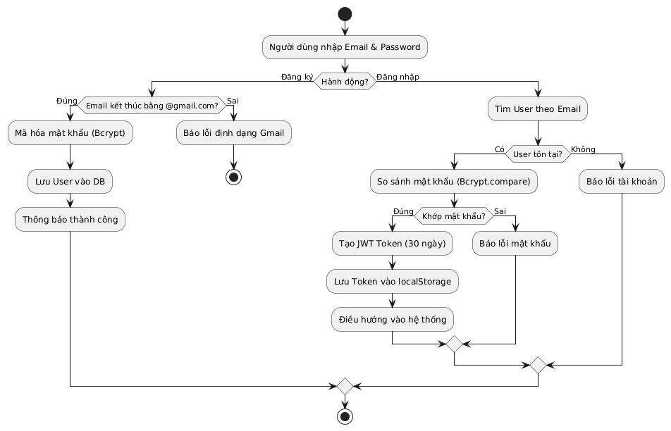
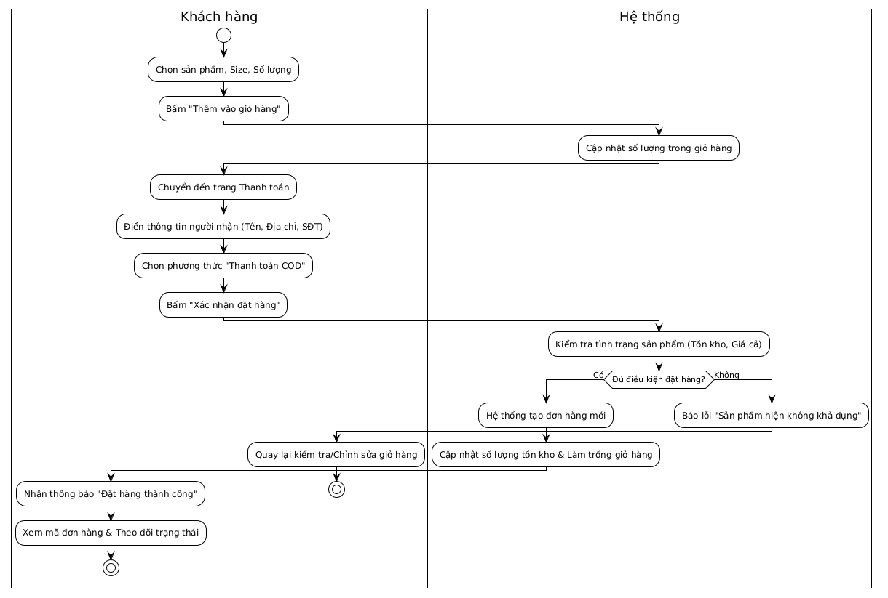
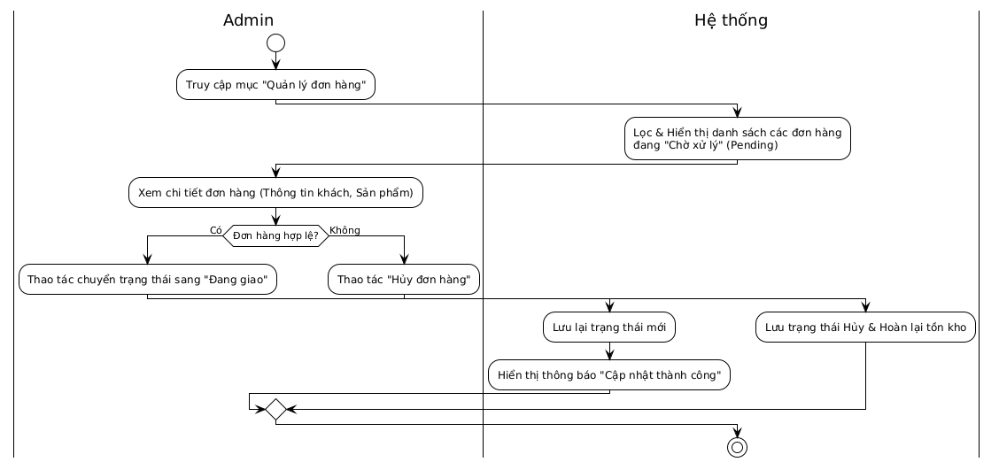

# ĐẶC TẢ SƠ ĐỒ HOẠT ĐỘNG (ACTIVITY DIAGRAMS)

Mô tả luồng xử lý nghiệp vụ cho các chức năng trọng yếu trong hệ thống.

---

## 1. Luồng Đăng ký & Đăng nhập (Registration & Login Flow)

1.  **Người dùng:** Nhập Email (định dạng @gmail.com) và Mật khẩu.
2.  **Hệ thống (Server):** 
    - Kiểm tra email có kết thúc bằng @gmail.com không (nếu là đăng ký).
    - So sánh mật khẩu đã mã hóa bằng Bcrypt (nếu là đăng nhập).
3.  **Kết quả:**
    - **Hợp lệ:** Server trả về JWT Token và thông tin cơ bản của User. Lưu vào `localStorage`. Điều hướng về trang chủ.
    - **Không hợp lệ:** Hiển thị thông báo lỗi tương ứng.

---

## 2. Luồng Đặt hàng (Checkout Flow)

1.  **Người dùng:** Chọn sản phẩm, số lượng và nhấn "Thêm vào giỏ".
2.  **Hệ thống:** Cập nhật giỏ hàng và hiển thị badge thông báo.
3.  **Thanh toán:** Người dùng điền thông tin và xác nhận. Hệ thống kiểm tra tồn kho và trừ kho.

---

## 3. Luồng Quản lý Đơn hàng (Order Management - Admin)

1.  **Admin:** Xem danh sách đơn hàng và cập nhật trạng thái vận hành.
2.  **Hệ thống:** Gửi request PUT và cập nhật MongoDB.

---

## 4. Luồng Quản Lý Hồ Sơ (User Profile)

1.  **Khách hàng:** Mở modal Profile và chọn "Edit" thông tin cá nhân hoặc địa chỉ.
2.  **Khách hàng:** Nhập thông tin mới (Tên, Số điện thoại, Size giày).
3.  **Hệ thống:** Lưu thay đổi vào trạng thái ứng dụng (State) và gửi cập nhật lên server (tương lai).
4.  **Kết quả:** Hiển thị Toast thông báo "Cập nhật thành công".
