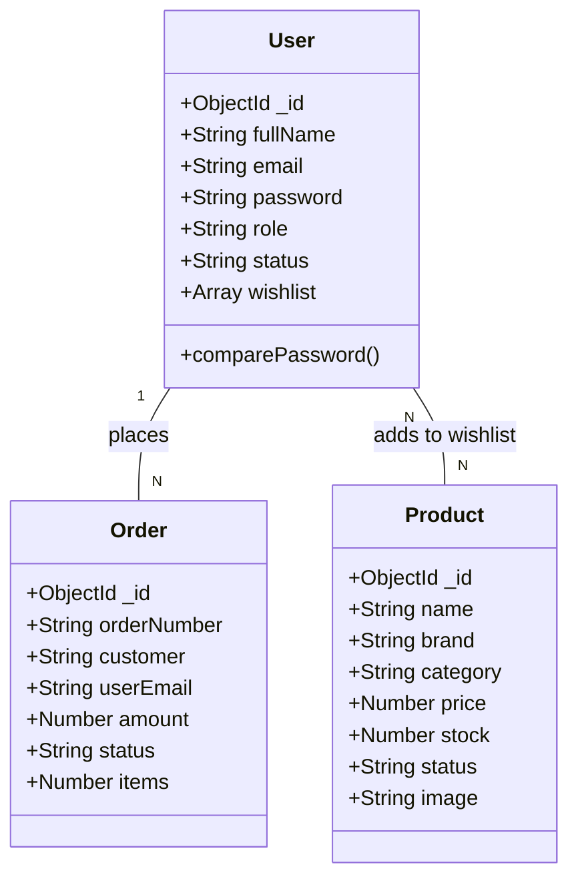
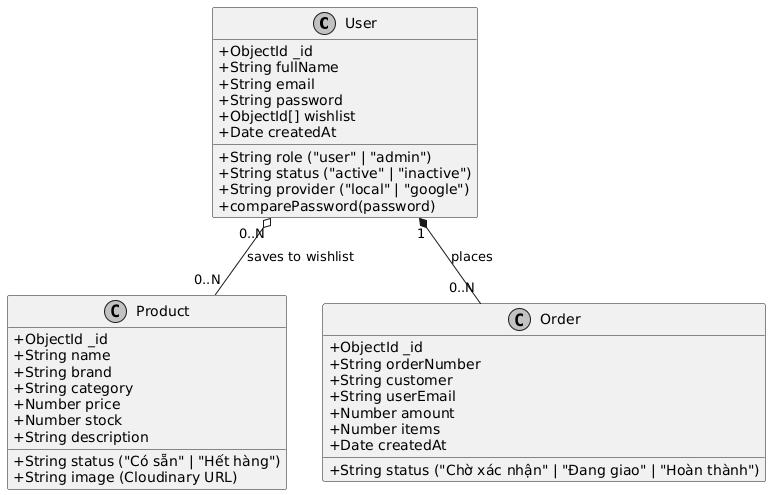

# BIỂU ĐỒ LỚP (CLASS DIAGRAM) - MÔ HÌNH DỮ LIỆU

Biểu đồ lớp dưới đây mô tả cấu trúc dữ liệu chính trong hệ thống, tương ứng với các Schema trong MongoDB (Mongoose).

---

## 1. Cấu trúc các Lớp (Models)

### Lớp: User (Người dùng)
- **Thuộc tính:**
    - `_id`: ObjectId (PK)
    - `fullName`: String
    - `email`: String (Unique, Gmail format)
    - `password`: String (Hashed)
    - `role`: String ('user', 'admin')
    - `status`: String ('active', 'inactive')
    - `provider`: String ('local', 'google', etc.)
    - `avatar`: String (URL)
    - `wishlist`: Array [Ref: Product]
    - `createdAt`: Date
- **Phương thức:**
    - `comparePassword(candidatePassword)`: Boolean
    - `pre('save')`: Hash password before saving

### Lớp: Product (Sản phẩm)
- **Thuộc tính:**
    - `_id`: ObjectId (PK)
    - `name`: String
    - `brand`: String
    - `category`: String
    - `price`: Number
    - `stock`: Number
    - `status`: String ('Có sẵn', 'Sắp hết', 'Hết hàng')
    - `description`: String
    - `image`: String (Cloudinary URL)
    - `createdAt`: Date

### Lớp: Order (Đơn hàng)
- **Thuộc tính:**
    - `_id`: ObjectId (PK)
    - `orderNumber`: String (Unique)
    - `customer`: String (Họ tên khách hàng)
    - `userEmail`: String (Ref: User.email)
    - `amount`: Number (Tổng tiền)
    - `status`: String ('Chờ xác nhận', 'Đang xử lý', 'Đang giao', 'Hoàn thành')
    - `items`: Number (Số lượng sản phẩm)
    - `createdAt`: Date

---

## 2. Quan hệ giữa các lớp (Relationships)

1.  **User ───< Wishlist (N-N):** Một người dùng có thể yêu thích nhiều sản phẩm và một sản phẩm có thể nằm trong danh sách yêu thích của nhiều người dùng (Được triển khai qua mảng `wishlist` trong User).
2.  **User ───< Order (1-N):** Một người dùng (qua email) có thể có nhiều đơn hàng trong hệ thống.
3.  **Order ─── Product (Tham chiếu gián tiếp):** Thông tin sản phẩm trong đơn hàng hiện tại được lưu trữ đơn giản qua trường `items` và `amount` (Trong phiên bản hiện tại của mã nguồn).

---

## 3. Sơ đồ minh họa

*(Lưu ý: Hình ảnh minh họa có thể cần cập nhật để khớp hoàn toàn với cấu trúc Schema thực tế bên trên)*
