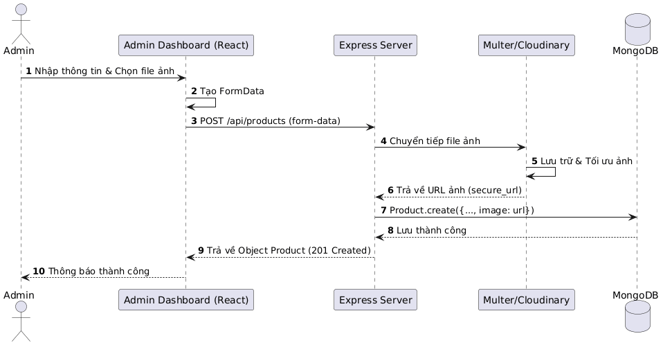
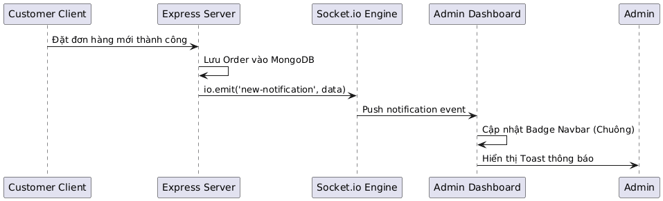

# BIỂU ĐỒ SEQUENCE (SEQUENCE DIAGRAM)

Mô tả sự tương tác giữa các thành phần (Frontend, Backend, Database) theo trình tự thời gian.

---

## 1. Sequence: Đăng nhập (Login)
*(Tương tự các luồng request-response chuẩn)*

---

## 2. Sequence: Thêm sản phẩm (Add Product - Cloudinary Flow)

1.  **Admin:** Điền form và chọn ảnh -> Nhấn "Lưu sản phẩm".
2.  **Frontend:** Gửi `POST /api/products` (Multipart form-data).
3.  **Backend (Multer):** Tiếp nhận file và chuyển tiếp cho Cloudinary.
4.  **Cloudinary:** Lưu trữ ảnh và trả về `secure_url`.
5.  **Backend:** Gọi `Product.create({...body, image: secure_url})`.

---

## 3. Sequence: Thông báo thời gian thực (Real-time Notification)

1.  **User:** Đăng ký tài khoản hoặc đặt hàng thành công.
2.  **Backend:** Xử lý logic lưu database xong.
3.  **Backend (Socket.io):** `io.emit('new-notification', {msg})` tới toàn bộ client Admin.

---

## 4. Sequence: Quản lý yêu thích (Toggle Wishlist)

1.  **User:** Click vào icon Tim trên Product Card.
2.  **Frontend:** Gửi `POST /api/users/wishlist/toggle` {productId, email}.
3.  **Backend:** 
    - Tìm User.
    - Kiểm tra xem sản phẩm đã có trong mảng `wishlist` chưa.
    - Thêm nếu chưa có, Xóa nếu đã có.
4.  **Backend:** Trả về danh sách `wishlist` mới.
5.  **Frontend:** Cập nhật icon Tim trên UI.
