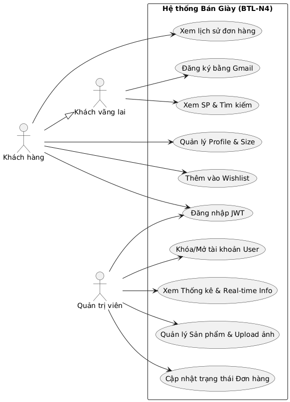

# BIỂU ĐỒ USE CASE (USE CASE DIAGRAM)

Hệ thống bao gồm 3 tác nhân chính: **Khách vãng lai**, **Khách hàng** (đã đăng nhập) và **Quản trị viên (Admin)**.

---

## 1. Khách vãng lai (Guest)
- **Xem trang chủ:** Xem các banner, sản phẩm đề xuất, sản phẩm mới.
- **Tìm kiếm sản phẩm:** Tìm theo tên hoặc thương hiệu.
- **Xem chi tiết sản phẩm:** Xem hình ảnh, giá, mô tả sản phẩm.
- **Đăng ký tài khoản:** Yêu cầu Gmail hợp lệ.

## 2. Khách hàng (Registered User)
- **Đăng nhập:** Truy cập hệ thống bằng tài khoản cá nhân.
- **Quản lý hồ sơ:** Cập nhật địa chỉ giao hàng, số điện thoại, size giày/quần áo ưu thích.
- **Quản lý Wishlist:** Lưu hoặc bỏ lưu sản phẩm vào danh sách yêu thích.
- **Xem lịch sử đơn hàng:** Theo dõi trạng thái các đơn hàng đã đặt.
- **Đăng xuất:** Thoát khỏi phiên làm việc an toàn.

## 3. Quản trị viên (Admin)
- **Xem Dashboard:** Thống kê doanh thu, tổng sản phẩm, đơn hàng, khách hàng.
- **Quản lý sản phẩm:** Thêm sản phẩm mới (upload ảnh Cloudinary), Xóa sản phẩm.
- **Quản lý đơn hàng:** Xem danh sách, cập nhật trạng thái vận hành.
- **Quản lý người dùng:** Xem danh sách khách hàng, Khóa hoặc Mở khóa tài khoản.
- **Xem báo cáo:** Biểu đồ tăng trưởng doanh thu theo tháng.
- **Cấu hình hệ thống:** Chỉnh sửa các cài đặt chung về trang web.

---

## Sơ đồ minh họa

```mermaid
usecaseDiagram
    actor "Khách vãng lai" as Guest
    actor "Khách hàng" as User
    actor "Quản trị viên" as Admin

    Guest --> (Xem sản phẩm)
    Guest --> (Tìm kiếm sản phẩm)
    Guest --> (Đăng ký tài khoản)

    User --> (Đăng nhập)
    User --> (Quản lý hồ sơ)
    User --> (Quản lý Wishlist)
    User --> (Xem lịch sử đơn hàng)

    Admin --> (Quản lý sản phẩm)
    Admin --> (Quản lý đơn hàng)
    Admin --> (Quản lý người dùng)
    Admin --> (Xem thống kê Dashboard)
```


